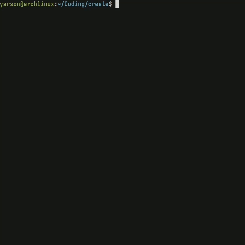

# Software is NOT finished! Do NOT have any expectations!

## Supported languages:
- [Rust](https://github.com/rust-lang/rust) (rs)
- [C](https://en.wikipedia.org/wiki/C_(programming_language)) (c)
- [C++](https://en.wikipedia.org/wiki/C%2B%2B) (cpp)
- [JS](https://en.wikipedia.org/wiki/JavaScript) (js)
- [Go](https://en.wikipedia.org/wiki/Go_(programming_language)) (go)
- [Php](https://en.wikipedia.org/wiki/PHP) (php)
- [Pascal](https://en.wikipedia.org/wiki/Pascal_(programming_language)) (pas)
- [Kotlin](https://en.wikipedia.org/wiki/Kotlin_(programming_language)) (kt)
- [Python](https://en.wikipedia.org/wiki/Python_(programming_language)) (py)
- [Lua](https://en.wikipedia.org/wiki/Lua_(programming_language)) (lua)

### In future i plan to add more and more languages.



# To run:
```shell
$ git clone --depth 1 https://github.com/rakivo/create && cd create
$ make
$ ./create hello rs test .
```

## To add the binary to your PATH variables:
```shell
$ ./addtopath.sh
```

## Usage:
```./create create <name> <language> <dir_name> <dir_path>```
for instance: ```./create hello rs test .```

### After present manipulations you can test that:
```shell
$ cd test
$ cargo run
```

#### The goal of this project is to create a lightweight tool for generating projects that is fast and convenient to use, avoiding the slowness found in many modern tools.
